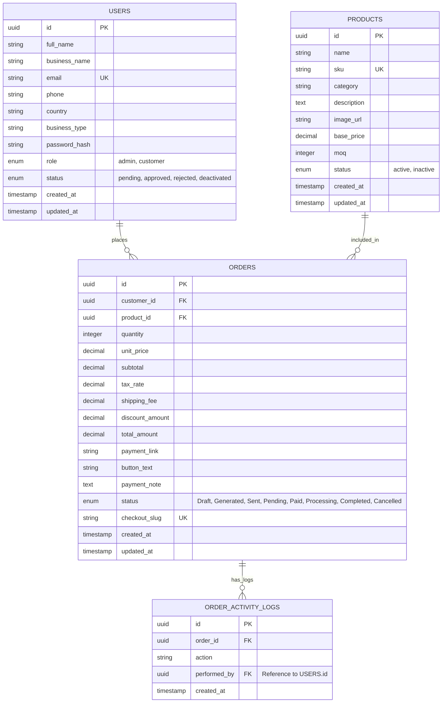

# Trend Crafters - B2B Database Schema

This document outlines the professional database architecture for the Trend Crafters wholesale platform. This schema is designed for scalability, supporting both SQL (PostgreSQL/MySQL) and NoSQL (Supabase/Firebase) backends.

## Entity Relationship Diagram (Conceptual)

## Table Definitions

### 1. Users Table
Stores administrative and wholesale partner identities.

| Field | Type | Constraint | Description |
| :--- | :--- | :--- | :--- |
| `id` | UUID | Primary Key | Unique identifier for the user. |
| `full_name` | String | Not Null | User's legal name. |
| `business_name` | String | Not Null | Company name for B2B verification. |
| `email` | String | Unique, Index | Business email address. |
| `password_hash` | String | Not Null | Argon2 or Bcrypt hash of the password. |
| `role` | Enum | Default: 'customer' | Access level (admin/customer). |
| `status` | Enum | Default: 'pending' | Approval state (pending/approved/etc). |

### 2. Products Table
Manages the wholesale catalog and inventory settings.

| Field | Type | Constraint | Description |
| :--- | :--- | :--- | :--- |
| `id` | UUID | Primary Key | Unique identifier for the product. |
| `sku` | String | Unique, Index | Stock Keeping Unit for inventory sync. |
| `base_price` | Decimal | Not Null | Default wholesale price (can be overridden in orders). |
| `moq` | Integer | Default: 1 | Minimum Order Quantity. |
| `status` | Enum | Default: 'active' | Visibility in the shop catalog. |

### 3. Orders Table
The core B2B negotiation and transaction record.

| Field | Type | Constraint | Description |
| :--- | :--- | :--- | :--- |
| `id` | UUID | Primary Key | Unique identifier for the order. |
| `customer_id` | UUID | Foreign Key | Reference to the USERS table. |
| `product_id` | UUID | Foreign Key | Reference to the PRODUCTS table. |
| `checkout_slug` | String | Unique, Index | Random string used for the public checkout URL. |
| `payment_link` | String | Not Null | The external payment gateway URL (Stripe/PayPal). |
| `status` | Enum | Not Null | Current lifecycle state of the order. |

### 4. Order Activity Logs
Audit trail for tracking the history of custom wholesale deals.

| Field | Type | Constraint | Description |
| :--- | :--- | :--- | :--- |
| `id` | UUID | Primary Key | |
| `order_id` | UUID | Foreign Key | Reference to the specific order. |
| `action` | String | | Description of change (e.g., "Status updated to Paid"). |
| `performed_by` | UUID | Foreign Key | The Admin who performed the action. |

---

## Security Implementation
- **Data Scoping**: All queries for `ORDERS` must include `WHERE customer_id = current_user_id` unless the user has the `admin` role.
- **Immutability**: `ORDER_ACTIVITY_LOGS` should be append-only to ensure a tamper-proof audit trail.
- **Indexing**: High-performance indexes are required on `email`, `sku`, `customer_id`, and `checkout_slug`.
